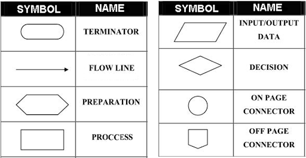
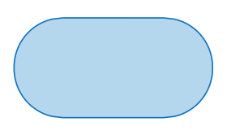
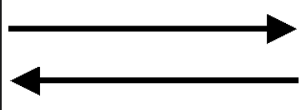
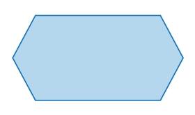
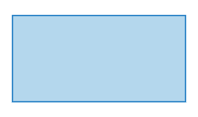
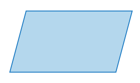
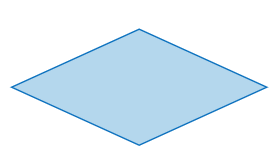
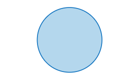
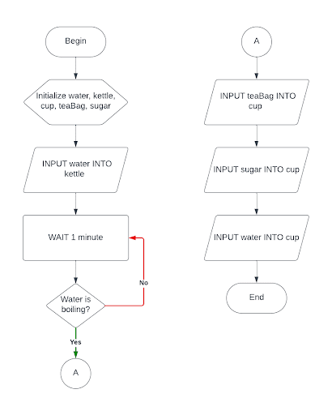

# What is Algorithms?
## Explanation
An `algorithm` is a step-by-step procedure or set of instructions designed to solve a problem, accomplish a task, or perform a specific computation.
## Why it's important
- Problem solving
- Decision making
- Efficiency
- Consistency
## Example
- Navigation App (ex: Google Maps)
- Social Media Feed (ex: Instagram, TikTok)
- Search Engine (ex: Google)
- Online Shopping (ex: Amazon)
## Written Description
A written description algorithm is a series of step-by-step instructions in plain language, describing how to solve a problem or perform a task.
::: details Example
1. Boil Water
2. Prepare Tea Bag
3. Pour Hot Water
4. Steep Tea
5. Remove Tea Bag
6. Add Sweetener/Milk
7. Stir and Enjoy
:::
## Pseudocode
Pseudocode is a detailed yet human-readable description of what a computer program or algorithm should do, resembling a mixture of natural language and programming constructs.

::: details Keywords
- Statement : BEGIN, END
- Input : INPUT, GET, READ
- Output : OUTPUT, PRINT, DISPLAY
- Initialize : INITIALIZE, SET
- Compute : COMPUTE, CALCULATE, ADD, SUM, SUBTRACT, MULTIPLY
- Looping : WHILE, END-WHILE, FOR, END-FOR, DO-WHILE, END-DO
- Selection : IF, END-IF
:::

::: details Example
```txt
BEGIN
    INITIALIZE water, kettle, cup, teaBag, sugar
    INPUT water INTO kettle
    WHILE water is not boiling
      	DO
          	WAIT 1 minute
      	ENDDO
    ENDWHILE
    INPUT teaBag INTO cup
    INPUT sugar INTO cup
    INPUT water INTO cup
END

```
:::

## Flowchart
A flowchart is a graphical representation using various shapes and arrows to illustrate the steps of a process or algorithm.
::: details Symbols

<!-- | Symbol | Name |
|--------|------|
|  | __TERMINATOR__ |
|  | __FLOW LINE__ |
|  | __PREPARATION__ |
|  | __PROCCESS__ |
|  | __INPUT/OUTPUT DATA__ |
|  | __DECISION__ |
|  | __ON PAGE CONNECTOR__ |
|  | __OFF PAGE CONNECTOR__ | -->
:::

::: details Example
