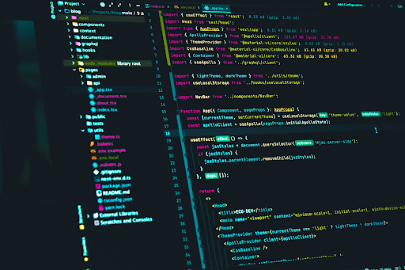

# What is programing?
`Programming` is the process of telling a computer to perform some tasks in order to solve problems.

::: raw
|  |  |
|---------------------------------------------|---------------------------------------------|
:::