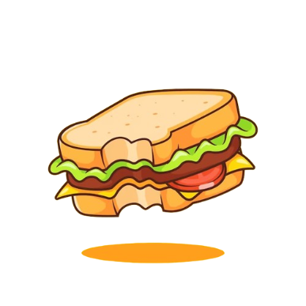

# Example of Use

Imagine you're making a sandwich. You have distinct steps: getting bread, adding ingredients like cheese, lettuce, and meat, and finally assembling it. Each step is like a function.  

- __Functionality:__ Functions are like individual steps in making a sandwich. They encapsulate specific actions.
- __Reuse:__ You can make different types of sandwiches using the same steps (functions) but with different ingredients.
- __Abstraction:__ You don't need to know how each ingredient is processed; you just focus on the step (function) needed.
- __Organization:__ Functions allow you to manage and understand the process of making a sandwich in a structured manner, just as functions organize code