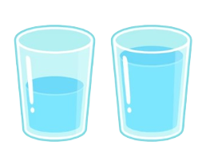

# Bubble Sort
`Bubble Sort` is a simple sorting algorithm that repeatedly steps through the list, compares adjacent elements, and swaps them if they are in the wrong order. This process continues until the entire list is sorted.  
  
Bubble Sort is best used for educational purposes to demonstrate sorting algorithms' basic principles. It can also be practical for sorting very small datasets or nearly sorted lists where simplicity is valued over efficiency.

::: details Advantages
1. Easy to understand and implement.
2. Requires minimal additional memory space since it operates on the given list itself.
3. Works well for small datasets or nearly sorted lists.
:::

::: details Disadvantages
1. Inefficient for large datasets due to its time complexity of O(n^2).
2. Performance decreases significantly as the number of elements grows.
3. Not suitable for practical use when efficiency is a priority.
:::

## Let’s try to sort these numbers ascending! [ 7 , 1 , 9 , 5 , 12 ]

::: info Step 1: Check the first and second number. If a > b, then switch
| 7 <Badge type="info" text="a (unswitched)" /> | 1 <Badge type="info" text="b (unswitched)" /> | 9 | 5 | 12|
|---|---|---|---|---|
| 1 <Badge type="tip" text="b (switched)" /> | 7 <Badge type="tip" text="a (switched)" /> | 9 | 5 | 12|
:::

::: info Step 2: Then continue to check second and third number. If a > b, then switch
| 1 | 7 <Badge type="info" text="a (no switch)" /> | 9 <Badge type="info" text="b (no switch)" /> | 5 | 12 |
|---|---|---|---|---|
:::

::: info Step 3: Check the third and fourth number. If a > b, then switch
| 1 | 7 | 5 <Badge type="tip" text="b (switched)" /> | 9 <Badge type="tip" text="a (switched)" /> | 12 |
|---|---|---|---|---|
:::

::: info Step 4: Check the fourth and fifth number. If a > b, then switch
| 1 | 7 | 5 | 9 <Badge type="info" text="a (no switch)" /> | 12  <Badge type="info" text="b (no switch)" /> |
|---|---|---|---|---|
:::

::: info Step 5: Do the same thing from step 1-4
| 1 <Badge type="info" text="a (no switch)" /> | 7 <Badge type="info" text="b (no switch)" /> | 9 | 5 | 12|
|---|---|---|---|---|
| 1 | 5 <Badge type="tip" text="b (switched)" /> | 7 <Badge type="tip" text="a (switched)" /> | 9 | 12 |
| 1 | 5 | 7 <Badge type="info" text="a (no switch)" /> | 9 <Badge type="info" text="b (no switch)" /> | 12 |
| 1 | 7 | 5 | 9 <Badge type="info" text="a (no switch)" /> | 12  <Badge type="info" text="b (no switch)" /> |
:::

For easier visualisation, let’s try using this website! [visualgo.net](https://visualgo.net/en/sorting)

## Pseudocode Algorithm
```txt
FOR i = 0 to size-1
	FOR i = 0 to size-i-1
        if leftElement > rightElement
            swap(leftElement, rightElement)
END FOR
```

## How to swap element?
Imagine you have a glass of water and soda. How do you swap those 2 drinks? You’ll need an extra glass right? That’s what we call as “temp” variable.
|  |  |
|:------:|:------:|
| a and b | temp |

::: code-group
```c [C/C++]
void bubbleSort(int arr[], int n) {
    for (int i = 0; i < n-1; i++) {
        for (int j = 0; j < n-i-1; j++) {
            if (arr[j] > arr[j+1]) {
                int temp = arr[j];
                arr[j] = arr[j+1];
                arr[j+1] = temp;
            }
        }
    }
}

int main() {
    int arr[] = {64, 25, 12, 22, 11}; //the array of numbers
    int n = sizeof(arr)/sizeof(arr[0]); //the size of the array
    bubbleSort(arr, n);
    for (int i = 0; i < n; i++) {
        //print arr[i]
    }
    return 0;
}
```
```java [Java]
void bubbleSort(int arr[]) {
    int n = arr.length; //to find the length of the array
    for (int i = 0; i < n - 1; i++) {
        for (int j = 0; j < n - i - 1; j++) {
            if (arr[j] > arr[j + 1]) {
                int temp = arr[j];
                arr[j] = arr[j + 1];
                arr[j + 1] = temp;
            }
        }
    }
}

public static void main(String[] args) {
    int arr[] = {64, 25, 12, 22, 11};
    BubbleSort sorter = new BubbleSort();
    sorter.bubbleSort(arr);
    for (int i = 0; i < arr.length; i++) {
        System.out.print(arr[i] + " ");
    }
}
```
```python [Python]
def bubble_sort(arr):
    n = len(arr)
    for i in range(n - 1):
        for j in range(n - i - 1):
            if arr[j] > arr[j + 1]:
                arr[j], arr[j + 1] = arr[j + 1], arr[j]

arr = [64, 25, 12, 22, 11]

bubble_sort(arr)

for i in range(len(arr)):
    print(arr[i], end=" ")
```
:::

::: details Breakdown
<ol>
    <li>The array to be sorted</li>
    {64, 25, 12, 22, 11}
    <li>First outer iteration (i=0)</li>
    <ol style="list-style-type: lower-alpha;">
        <li>First inner iteration (j=0)</li>
        <ul>
            <li>Compare if arr[0] > arr[1]. Because 64 > 25, then swap the position</li>
            temp = 64;<br>
            arr[j] = 25;<br>
            arr[j+1] = temp;<br>  
            <li>So now the array will be {25, 64, 12, 22, 11}</li>
        </ul>
        <li>Second inner iteration (j=1)</li>
        <ul>
            <li>Compare if arr[1] > arr[2]. Because 64 > 12, then swap the position</li>
            temp = 64;<br>
            arr[j] = 12;<br>
            arr[j+1] = temp;<br>
            <li>So now the array will be {25, 12, 64, 22, 11}</li>
        </ul>
        <li>Third inner iteration (j=2)</li>
        <ul>
            <li>Compare if arr[2] > arr[3]. Because 64 > 22, then swap the position</li> 
            temp = 64;<br>
            arr[j] = 22;<br>
            arr[j+1] = temp;<br>
            <li>So now the array will be {25, 12, 22, 64, 11}</li>
        </ul>
        <li>Third inner iteration (j=3)</li>
        <ul>
            <li>Compare if arr[3] > arr[4]. Because 64 > 11, then swap the position</li> 
            temp = 64;<br>
            arr[j] = 11;<br>
            arr[j+1] = temp;<br>
            <li>So now the array will be {25, 12, 22, 11, 64}</li>
        </ul>
    </ol>
</ol>

```cmd
for (int j = 0; j < n = i - 1; j++ ) {
    if (arr[j] > arr[j+1]) {
        int temp = arr[j];
        arr[j] = arr [j+1];
        arr[j+1] = temp;
    }
}
```
- Because the rule is j < n-i-1, where n = size of array, that means j < 5-0-1, so j < 4. That’s why it’s stopped when j=3.
- In the second outer iteration, where i = 1, then the condition of the inner iteration will be:
j=0; j < 5-1-1; j++ or j=0; j < 3; j++
- You can continue it yourself!
:::

## Exercise

::: tip What to do?
1. You're given an array representing the temperatures in Celsius for a week: [22, 19, 25, 18, 20, 23, 21]. Implement Bubble Sort to sort the temperatures in ascending order.
2. Consider the following array representing the prices of various books in dollars: [12.99, 9.99, 5.49, 15.79, 8.29, 11.59]. Use the Bubble Sort algorithm to sort the book prices in ascending order.
3. Suppose you have an array representing the ages of students in a class: [18, 16, 17, 15, 19, 20, 16]. Apply Bubble Sort to sort the ages in ascending order.
:::

::: warning Want more challenge?
4. Given an array representing the scores of players in a game: [85, 92, 78, 96, 88, 90]. Write a program using the Bubble Sort algorithm to sort the scores in descending order.
:::


