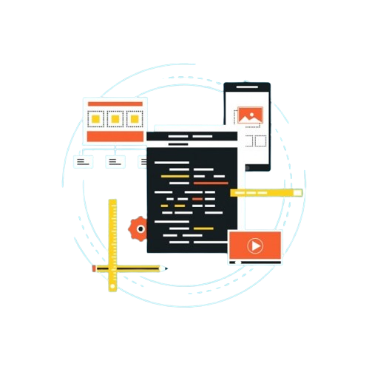

# Introduction
`Object-Oriented Programming (OOP)` is a programming paradigm that organizes code around the concept of "objects," which can contain data (attributes or properties) and code (methods or functions). The components of OOP are classes, objects, attributes, and methods

::: info The key principles of OOP are:
1. Encapsulation
2. Abstraction
3. Inheritance
4. Polymorphism
::: 

`OOP` promotes modularity, reusability,
and a more intuitive way of thinking
about and structuring code by organizing it
around objects and their interactions.

