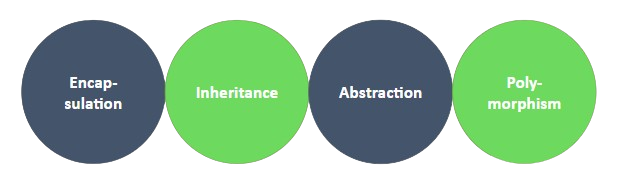

# Introduction
Do you remember `about the object-oriented programming (OOP)` that we’ve learned in the previous meeting? Let's jog our memories by answering these review questions!

::: info Questions
1. What distinguishes a class from an object?
2. What elements can a class hold?
3. What's essential in a class for creating an object?
4. How do we bring an object into existence?
:::

Today, let's learn about the `4 fundamental concepts` in OOP.
